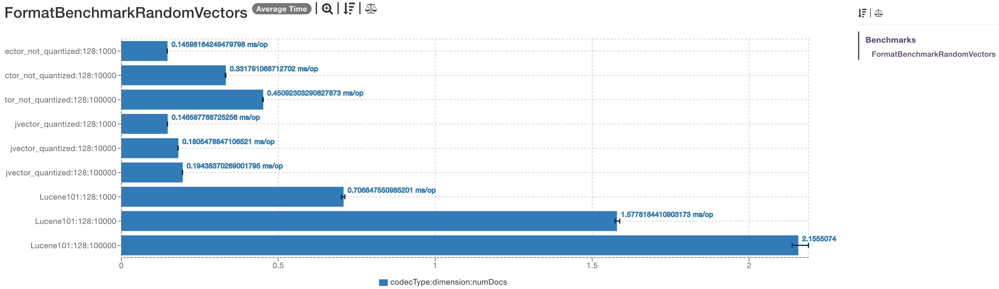

[](https://github.com/opensearch-project/k-NN/actions/workflows/CI.yml)
[](https://codecov.io/gh/opensearch-project/k-NN)
[](https://opensearch.org/docs/search-plugins/knn/index/)
[](https://forum.opensearch.org/c/plugins/k-nn/48)


# opensearch-jvector-plugin
- [Welcome!](#welcome)
- [Project Resources](#project-resources)
- [Credits and  Acknowledgments](#credits-and-acknowledgments)
- [Code of Conduct](#code-of-conduct)
- [License](#license)
- [Copyright](#copyright)

## Welcome!

**OpenSearch jVector Plugin** enables you to run the nearest neighbor search on billions of documents across thousands of dimensions with the same ease as running any regular OpenSearch query. You can use aggregations and filter clauses to further refine your similarity search operations. k-NN similarity search powers use cases such as product recommendations, fraud detection, image and video search, related document search, and more.

### Why use OpenSearch jVector Plugin?

#### High Level
- **Scalable**: Run similarity search on billions of documents across thousands of dimensions without exceeding memory and without choking on the disk by using DiskANN
- **Fast**: Blazing fast pure Java implementation with minimal overhead (see [benchmarks](#benchmarks))
- **Lightweight**: Pure Java implementation. Self-contained, builds in seconds, no need to deal with native dependencies and complex flaky builds or additional 100,000s lines of code you didn't ask for.

#### Unique Features
- _**DiskANN**_ - JVector is a pure Java implementation capable to perform vector ANN search in a way that is optimized for RAM bound environments with minimal additional overhead. No need involving native dependencies (FAISS) and cumbersome JNI mechanism.
- _**Thread Safety**_ - JVector is a threadsafe index that supports concurrent modification and inserts with near perfect scalability as you add cores, Lucene is not threadsafe; This allows us to ingest much higher volume of vectors a lot faster without unnecessary merge operations to parallelize ingestion concurrency.
- _**quantized index construction**_ - JVector can perform index construction w/ quantized vectors, saving memory = larger segments = fewer segments = faster searches
- _**Quantized Disk ANN**_ - JVector supports DiskANN style quantization with rerank, it's quite easy (in principle) to demonstrate that this is a massive difference in performance for larger-than-memory indexes (in practice it takes days/weeks to insert enough vectors into Lucene to show this b/c of the single threaded problem, that's the only hard part)
- _**PQ and BQ support**_  - As part of (3) JVector supports PQ as well as the BQ that Lucene offers, it seems that this is fairly rare (pgvector doesn't do PQ either) because (1) the code required to get high performance ADC with SIMD is a bit involved and (2) it requires a separate codebook which Lucene isn't set up to easily accommodate.  PQ at 64x compression gives you higher relevance than BQ at 32x
- _**Fused ADC**_ - Features that nobody else has like Fused ADC and NVQ and Anisotropic PQ
- _**Compatibility**_ - JVector is compatible with Cassandra. Which allows to more easily transfer vector encoded data from Cassandra to OpenSearch and vice versa.

## Project Resources

* [Project Website](https://opensearch.org/)
* [Downloads](https://opensearch.org/downloads.html).
* [Documentation](https://opensearch.org/docs/search-plugins/knn/index/)
* Need help? Try the [Forum](https://forum.opensearch.org/c/plugins/k-nn/48)
* [Project Principles](https://opensearch.org/#principles)
* [Contributing to OpenSearch jVector Plugin](CONTRIBUTING.md)
* [Maintainer Responsibilities](MAINTAINERS.md)
* [Release Management](RELEASING.md)
* [Admin Responsibilities](ADMINS.md)
* [Security](SECURITY.md)

## Benchmarks
As of today we have collected compelling data that shown us clear performance advantages for jVector compared to other KNN engines which is why we think it will be a good addition
to OpenSearch vector search engines.
For example: We have compared with the default Lucene HNSW graph implementation and noticed a significantly increasing latency benefits
even from as small as 10,000 vectors datasets but exponentially increasing with the dataset size and further increasing by several order of magnitude 
with the decrease in the Operating System File System cache (as is expected in RAM constrained environments)
**Sample JMH engine output**
_Important note: JMH numbers are qualitative and relative and should not be treated as "globally consistent". 
Or in other words, the numbers below only illustrate the relative ratio of performance difference and while they may vary across systems, the ratios should remain constant._

```shell
Benchmark                                               (codecType)  (dimension)  (numDocs)  Mode  Cnt  Score   Error  Units
FormatBenchmarkRandomVectors.benchmarkSearch  jvector_not_quantized          128       1000  avgt    5  0.146 ± 0.002  ms/op
FormatBenchmarkRandomVectors.benchmarkSearch  jvector_not_quantized          128      10000  avgt    5  0.332 ± 0.003  ms/op
FormatBenchmarkRandomVectors.benchmarkSearch  jvector_not_quantized          128     100000  avgt    5  0.451 ± 0.004  ms/op
FormatBenchmarkRandomVectors.benchmarkSearch      jvector_quantized          128       1000  avgt    5  0.147 ± 0.001  ms/op
FormatBenchmarkRandomVectors.benchmarkSearch      jvector_quantized          128      10000  avgt    5  0.181 ± 0.002  ms/op
FormatBenchmarkRandomVectors.benchmarkSearch      jvector_quantized          128     100000  avgt    5  0.194 ± 0.002  ms/op
FormatBenchmarkRandomVectors.benchmarkSearch              Lucene101          128       1000  avgt    5  0.707 ± 0.016  ms/op
FormatBenchmarkRandomVectors.benchmarkSearch              Lucene101          128      10000  avgt    5  1.578 ± 0.022  ms/op
FormatBenchmarkRandomVectors.benchmarkSearch              Lucene101          128     100000  avgt    5  2.156 ± 0.080  ms/op
```



The numbers above were collected in an environment that all data was cached in either JVM or Operating System cache memory.
And we can already see a significant difference in performance!

When we are moving to a RAM constrained environment we will see an order of magnitude of difference:


## Credits and Acknowledgments

This project uses two similarity search libraries to perform Approximate Nearest Neighbor Search: the Apache 2.0-licensed [Lucene](https://github.com/apache/lucene) and [jVector](https://github.com/jbellis/jvector).

## Code of Conduct

This project has adopted the [Placeholder Open Source Code of Conduct](CODE_OF_CONDUCT.md). For more information see the [Code of Conduct FAQ](https://aws.github.io/code-of-conduct-faq), or contact [placeholder](mailto:placeholder) with any additional questions or comments.

## License

This project is licensed under the [Apache v2.0 License](LICENSE.txt).

## Copyright

Copyright OpenSearch Contributors. See [NOTICE](NOTICE.txt) for details.